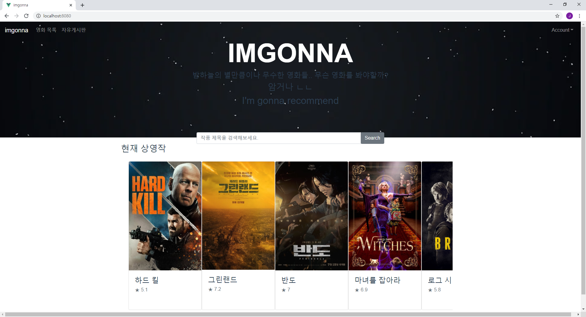

# imgonna

> 귀찮으니까 암거나(imgonna) 추천해주는 영화 추천 서비스


## 목차
- [개요](#개요)
- [기능](#기능)
- [유사 서비스](#유사-서비스)
- [향후 전망](#향후-전망)
- [기술 스택](#기술-스택)
- [기술 설명](#기술-설명)
	- [ERD](#erd)
	- [디렉토리 구조도](#디렉토리-구조도)
	- [기타](#기타)
- [테스트 방법](#테스트-방법)

## 개요
> TMDB API를 활용해 영화 정보를 제공하고 영화 

## 기능
> 프로젝트의 기능들을 설명해주세요  
> 스크린샷이나 gif등으로 한눈에 볼 수 있게 하면 더 좋습니다




## 기술 스택
- Backend - Django
- Frontend - Vue.js


## 기술 설명

### ERD
> DB 및 백엔드를 구현할 때 ERD를 그려보고 리드미에 남겨주세요


### 디렉토리 구조도
> 폴더 구조가 어떻게 되는지 폴더, 파일별 역할들을 간략하게 적어주세요  
> 너무 자세히 적을 필요는 없습니다

```
📁imgonna
├─📁backend
│   ├─📁accounts
│   ├─📁articles
│   ├─📁backend
│   ├─📁movies
│   ├─📁reviews
│   ├─db.sqlite3
│   └─manage.py
└─📁frontend
    ├─📁node_modules
    ├─📁public
    ├─📁src
    │   ├─📁components
    │   ├─📁router
    │   ├─📁views
    │   ├─App.vue
    │   └─main.js
    ├─.env.local
    └─packages.json
```


### 기타
> 이외에도 프로젝트를 이해하기 위해 필요한 것들을 적어주세요 (팀별 개발표준, API Documentation 등등...)

## 테스트 방법
> 프로젝트를 배포한 url과 테스트하기 위한 계정 ID/PW를 적어주세요